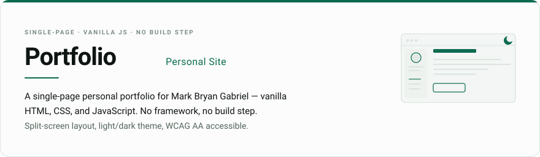
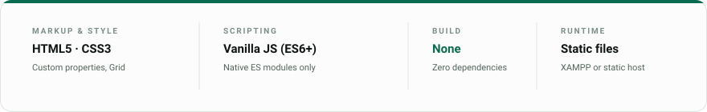

<picture>
  <source media="(prefers-color-scheme: dark)" srcset="assets/portfolio-hero-dark.svg">
  <source media="(prefers-color-scheme: light)" srcset="assets/portfolio-hero-light.svg">
  
</picture>

## Features

- **Responsive** — split-screen desktop, single-column mobile with bottom nav
- **Light/dark theme** — remembers your choice, no flash on load, smooth reveal transition
- **Active scroll nav** — highlights your current section via `aria-current`
- **Screenshot gallery** — inline rail on desktop, modal + zoom on mobile
- **Reduced-motion aware** — scroll animations respect `prefers-reduced-motion`
- **WCAG AA accessible** — 44px touch targets, focus states, skip links
- **SEO ready** — Open Graph, JSON-LD, canonical URLs, sitemap, robots.txt

## Tech Stack

<picture>
  <source media="(prefers-color-scheme: dark)" srcset="assets/portfolio-stack-dark.svg">
  <source media="(prefers-color-scheme: light)" srcset="assets/portfolio-stack-light.svg">
  
</picture>

